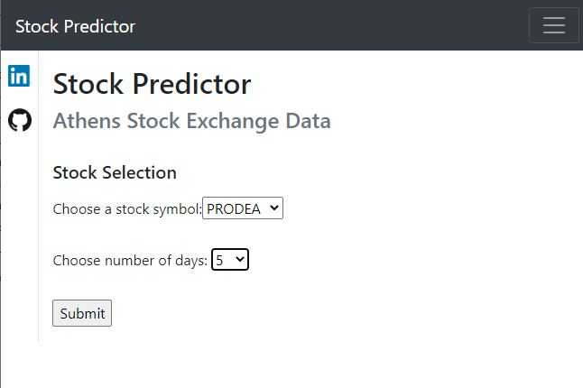
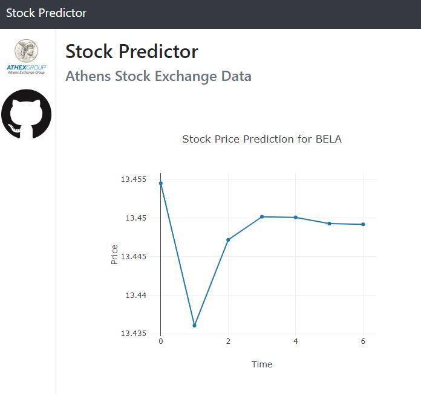
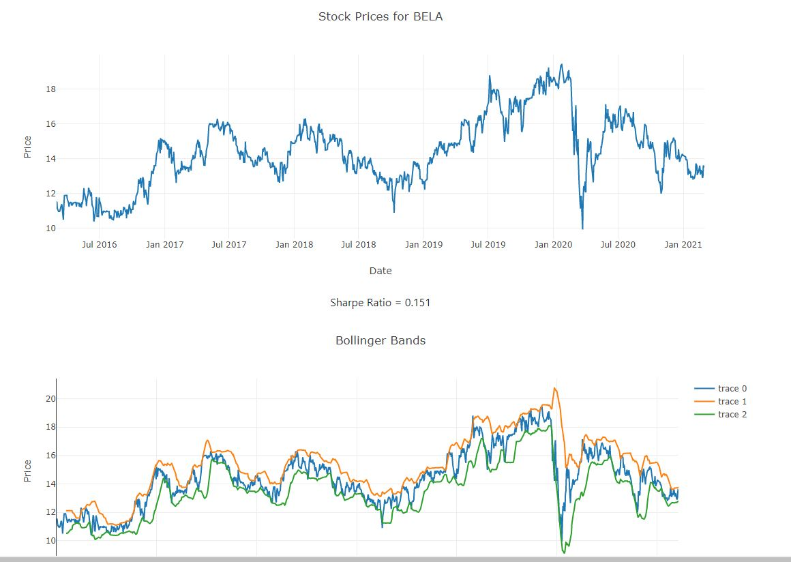

# Stock Price Prediction #

## Project Overview ##

The scope of this project is to try predicting stock market values by exploring various techniques. 

Stock market prediction is the act of trying to determine the future value of a company stock or other financial instrument traded on an exchange. If we are able to successfully predict a stock's future price we can receive significant profit. According to the efficient-market hypothesis, stock prices reflect all currently available information including price changes that are not based on newly revealed information, so they are inherently unpredictable. However there are many that disagree and they try to "beat the market", in other words achieving better returns than a market benchmark, by using various methods and technologies. We are going to look some of them, related to Technical Analysis and we are also going to make use of some Machine Learning algorithms that seem appropriate with time series data, as the stock data, that we need to analyse.

The data that are used, are stock data from [Athens Stock Exchange](https://en.wikipedia.org/wiki/Athens_Exchange) and we will retrieve them from the web site of Naftemporiki greek financial newspaper, where there are freely available.
    

## Problem Statement ##

Our aim is to be able to select from a predefined list of stocks and make predictions for the next few days by using the most appropriate tool, as per our analysis. 
In order to select the tool to be used in our predictions a short review of some Technical Analysis metrics will take place as long as some ML algorithms.

## Metrics ##

In order to measure the performance of a model or result we will visualise the actual and the predicted stock values, in each case and also use metrics such as mean squared error (MSE) which can provide an indication of the accuracy of our model.

## Files in the repository ##

The project consists of a Jupyter Notebook that contains the relevant steps and analysis, along with the python code used to create a WEB application.

- StockPredictor.py       # init file
- _StockPredictor_        # code folder
    - routes.py           # flask engine
    - __init__.py         # flask init
    - _templates_         # htmp templates folder
        - home.html       # form html file
        - index.html      # results html file
    - _data_scripts_      # scripts folder
        - load_data.py    # data manipulation and visualisation  

## Analysis ##

The stock data contain various attributes from which we concentrate in the closing price. In our case, this price is the same as the adjusted closing price, since it reflects the actual historical value of the stock after accounting for any corporate actions (stock split, dividends, etc.). After retrieving, cleaning and exploring the data we continue by using various stock prediction techniques.

Initially we check some Technical Analysis metrics. Technical analysis is a trading discipline employed to evaluate investments and identify trading opportunities by analyzing statistical trends gathered from trading activity, such as price movement and volume. Unlike fundamental analysis, which attempts to evaluate a stock's value based on business results such as sales and earnings, technical analysis focuses on the study of price and volume. 

After looking on those metrics we explore the use of two ML algorithms.

Long short-term memory (LSTM) is an artificial recurrent neural network (RNN) architecture that is used in the field of deep learning. Unlike standard feedforward neural networks, LSTM has feedback connections.
LSTM networks are well-suited to classifying, processing and making predictions based on time series data, since there can be lags of unknown duration between important events in a time series.

Autoregressive ntegrated moving average (ARIMA) model is a generalization of an autoregressive moving average (ARMA) model. Both of these models are fitted to time series data either to better understand the data or to do forecasting, i.e. predict future points in the series. 

## Installation and Instructions ##

Execute --> python StockPredictor.py

Navigate to localhost:8000

Select stock symbol and number of days to predict

The ML model, which has allready been tested in relevant Notebook, uses as training data the set of historical data up until the lastest closing price, so that it predicts the next few days. 

## Conclusion ##

Based on the analysis that took place we have achieved an adequate precision in predicted the relevant stocks, however a combination of tools both in terms of Technical Analysis and in terms of Machine Learning is probably the best way for an investor to decide when to buy or sell a stock. Thus in the web app that has been created a selection of a stock and the number of days for which we need a prediction to be made and we are presented with the relecant forecast along with a technical analysis metric, a combination of which might lead us to perform stock more confidently related actions (buy/sell/hold).

## Considerations and future work ##

The tool created, just illustrates the potential of using various tools and techniques for stock prediction and cannot be actually used to perform stock trading. However an advanced system that may use a combination of ML tools and techniques, including Natural Language Processing (NLP), that might retrieve and analyse news and information that is related to the Stock Market and the businesses that are represented them is something that can lead to trading strategies and actions that can surpass the market performance and lead to considerable gaining.

## Acknowledgements ##

- [Data Scientist Nanodegree Program](https://classroom.udacity.com/nanodegrees/nd025-ent/)
- [Machine Learning for Trading, Tucker Balch (Georgia Tech and Udacity)](https://www.google.com/url?q=https://www.udacity.com/course/machine-learning-for-trading--ud501&sa=D&source=editors&ust=1614536632888000&usg=AOvVaw0A6BjJrXN_QqIHGTkM-T-m)
- [Wikipedia](https://en.wikipedia.org/)
- [Investopedia](https://www.investopedia.com/)
- [Naftemporiki](https://www.naftemporiki.gr/)
- [Athens Exchange Group](athexgroup.gr)
